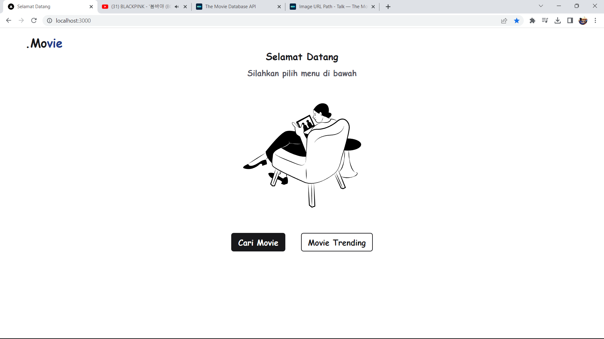

### Tech stack
* Next JS 13
* Typescript
* APIs
* Tailwind CSS

### Search Movies
1. First you have to generate your api key <a href="https://developers.themoviedb.org/3/getting-started/introduction">here<a/> \
   read the documentation to help you create an api key
2. Then create a `.env.local` file
3. After that, write in your `.env.local` like this:
   ```
   API_KEY=Your_API
   ```
4. After that you can run the
  ```
  npm install
  ```
  command first to install all packages
  then run the 
  ```
  npm run dev
  ```
  command.
  
### Priview

